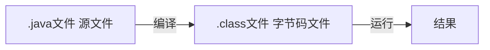
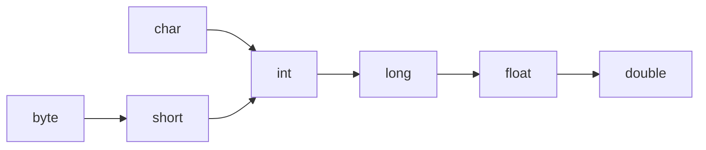

# 一.java概述

## 1.Java语言十大特点

分别为：简单性、面向对象、分布性、编译和解释性、稳健性、安全性、可移植性、高性能、多线索性、动态性。

1. 简单性：Java语言继承了C++语言的优点，去掉了C++中学习起来比较难的多继承、指针等概念，所以Java语言学习起来更简单，使用起来也更方便。

2. **面向对象**：Java是一种面向对象的编程语言。

3. 分布性：Java设计成支持在网络上应用，它是分布式语言。所以只要用Java编写了一个程序，就可以到处应用。可以节省大量人力物力。

4. **编译和解释性**：Java编译程序生成字节码，而不是通常的机器码，这使得Java开发程序比用其他语言开发程序快很多。

5. **稳健性**：Java刚开始被设计出来就是为了写高可靠和稳健的软件的。所以用Java写可靠的软件很容易。目前许多第三方交易系统、银行平台的前台和后台电子交易系统等都会用Java语言开发。

6. 安全性：Java的存储分配模型是它防御恶意代码的主要方法之一。所以很多大型企业级项目开发都会选择用Java开发。

7. **可移植性**：Java并不依赖平台，用Java编写的程序可以运用到任何操作系统上。

    JVM: Java Virtual Machine java虚拟机机制屏蔽了底层运行平台的差别，实现了“一次编译，到处运行”

   1. JVM 像一个翻译，其把 JAVA 字节码实时翻译成对应硬件 CPU 的机器语言，因为有这么一个翻译的开销，所以 JAVA 运行速度较慢。
   2.   一个 JVM 只知晓一门硬件语言，所以不同的平台（ CPU 不同）将需要安装不同的 JVM.
   3.   因为 JVM 机制的存在， JAVA 可以跨平台， JAVA 的跨平台是建立在 JVM 不跨平台的基础上的。
   4. 因为依靠 JVM 机制， JAVA 运行速度慢，但稳定安全。

8. 高性能：Java是一种先编译后解释的语言，所以它不如全编译性语言快。但Java设计者制作了“及时”编译程序，这样就可以实现全编译了。

9. 多线索性：Java是多线索语言，它可以同时执行多个程序，能处理不同任务。

10. 动态性：Java语言设计成适应于变化的环境，它是一个动态的语言。

## 2.JDK和JRE的区别

JDK：Java Development Kit Java开发工具包
JDK = JRE + java开发工具[java,javac,javadoc,javap等]

JRE：Java Runtime Environment Java运行环境
JRE = JVM + Java核心类库

## 3.环境变量

当前执行的程序在当前目录下如果不存在，win10系统会在系统中已有的一个名为path的环境变量指定的目录中查找。如果仍未找到，就会出现，所有需要配置环境变量，注意 ：系统变量对所有用户生效，而***的用户变量只对指定用户生效

```
'aa' 不是内部或外部命令，也不是可运行的程序或批处理文件。
```

## 4.Java执行流程



**Class文件**：

1. Java字节码类文件（.class）是Java编译器编译Java源文件（.java）产生的“目标文件”。它是一种8位字节的二进制流文件， 各个数据项按顺序紧密的从前向后排列， 相邻的项之间没有间隙， 这样可以使得class文件非常紧凑， 体积轻巧， 可以被JVM快速的加载至内存， 并且占据较少的内存空间（方便于网络的传输）。
2. Java源文件在被Java编译器编译之后， 每个类（或者接口）都单独占据一个class文件， 并且类中的所有信息都会在class文件中有相应的描述， 由于class文件很灵活， 它甚至比Java源文件有着更强的描述能力。

3. class文件中的信息是一项一项排列的， 每项数据都有它的固定长度， 有的占一个字节， 有的占两个字节， 还有的占四个字节或8个字节， 数据项的不同长度分别用u1, u2, u4, u8表示， 分别表示一种数据项在class文件中占据一个字节， 两个字节， 4个字节和8个字节。 可以把u1, u2, u3, u4看做class文件数据项的“类型” 。

**运行**：本质是通过运行工具java.exe对字节码文件进行执行，本质就是.class装载到jvm执行

## 5.常用转义字符

```
\t : 一个制表符，实现对齐的功能
\n : 换行符
\\ : 一个\
\" : 一个"
\' : 一个'
\r : 一个回车
```

## 6.注释(comment)

```java
//单行注释    

/*
多行注释
*/


/**
 * @program: demo
 * @description: 文档注释
 * @author: xfeng
 * @create: 2021-12-23 23:00
 **/
```

文档注释：
注释内容可以被JDK提供的工具javadoc解析，生成一套以网页文件形式体现的该程序的说明文档，一般注释在类和方法的上方

如何生成对应的文档注释：javadoc -d 生成文件夹名 -xx -yy  ***.java

## 7.代码规范

参考阿里巴巴集团技术团队发布的《*Java 开发手册*》


# 二.变量

## **1.变量基础概念**

变量相当于内存中一个数据存储空间的表示，你可以把变量看做是一个房间的门牌号，通过门牌号我们可以找到房 间，而通过变量名可以访问到变量(值)

**变量使用的基本步骤** 

1) 声明变量 int a; 

2) 赋值 a = 60; 

   //应该这么说: 把 60 赋给 a 使用 System.out.println(a); 

    //也可以一步到位[int a = 60; 通常我们是一步完成]

注意

- 变量表示内存中的一个存储区域[不同的变量，类型不同，占用的空间大小不同]
- 该区域有自己的名称[变量名]和类型[数据类型]
- 变量必须先声明，后使用，即有顺序
- 该区域的数据/值可以在同一类型范围内不断变化
- 变量在同一作用域内不能重名
- 变量=变量名+值+数据类型

## 2.数据类型


| 数据类型    | 位数 | 范围（二进制）               | 范围（转十进制）                                   |                        范围（十进制）                        |
| :---------| ---- | :--------------------------: | :------------------------------------------------: | :----------------------------------------------------------: |
| byte字节    | 8    | 负数：11111111正数：01111111 | 负数：-2^7。正数：1000000 - 1 = 01111111 → 2^7 - 1 |                    负数：-128。正数：127                     |
| short短整型 | 16   |                              | 负数：-2^16。正数：2^16 - 1                        |                  负数：-32768。正数：32767                   |
| int整型     | 32   |                              | 负数：-2^32。正数：2^32 - 1                        |             负数：-2147483648。正数：2147483647              |
| long长整型  | 64   |                              | 负数：-2^64。正数：2^64 - 1                        |    负数：-9223372036854775808。正数：9223372036854775807     |
| float       | 32   |                              | 负数：-2^32。正数：2^32 - 1                        | 负数：1.4E-45 （2的-149次方）。正数：3.4028235E38 （2的128次方-1） |
| double      | 64   |                              | 负数：-2^64                                        | 负数：4.9E-324 （2的-1074次方）。正数：1.7976931348623157E308 （2的1024次方-1） |
| char        | 16   |                              | 正数：2^64 - 1                                     |                                                              |
| boolean     |      |                              |                                                    |                                                              |


## 3.类型转换

### **自动类型转换**



注意：

```java
//自动类型转换细节
public class AutoConvertDetail {
    //编写一个 main 方法
    public static void main(String[] args) {
        //细节 1： 有多种类型的数据混合运算时，
        //系统首先自动将所有数据转换成容量最大的那种数据类型，然后再进行计算
        int n1 = 10; //ok
        //float d1 = n1 + 1.1;//错误 n1 + 1.1 => 结果类型是 double
        //double d1 = n1 + 1.1;//对 n1 + 1.1 => 结果类型是 double
        float d1 = n1 + 1.1F;//对 n1 + 1.1 => 结果类型是 float
        //细节 2: 当我们把精度(容量)大 的数据类型赋值给精度(容量)小 的数据类型时，
        //就会报错，反之就会进行自动类型转换。
        //
        //int n2 = 1.1;//错误 double -> int
        //细节 3: (byte, short) 和 char 之间不会相互自动转换
        //当把具体数赋给 byte 时，(1)先判断该数是否在 byte 范围内，如果是就可以
        byte b1 = 10; //对 , -128-127
        // int n2 = 1; //n2 是 int
        // byte b2 = n2; //错误，原因： 如果是变量赋值，判断类型
        //
        // char c1 = b1; //错误， 原因 byte 不能自动转成 char
        //
        //
        //细节 4: byte，short，char 他们三者可以计算，在计算时首先转换为 int 类型
        byte b2 = 1;
        byte b3 = 2;
        short s1 = 1;
        //short s2 = b2 + s1;//错, b2 + s1 => int
        int s2 = b2 + s1;//对, b2 + s1 => int
        //byte b4 = b2 + b3; //错误: b2 + b3 => int
        //
        //boolean 不参与转换
        boolean pass = true;
        //int num100 = pass;// boolean 不参与类型的自动转换
        //自动提升原则： 表达式结果的类型自动提升为 操作数中最大的类型
        //看一道题
        byte b4 = 1;
        short s3 = 100;
        int num200 = 1;
        float num300 = 1.1F;
        double num500 = b4 + s3 + num200 + num300; //float -> double
}
}
```

### 强制类型转换

自动类型转换的逆过程，将容量大的数据类型转换为容量小的数据类型。使用时要加上强制转换符 ( )，但可能造成精度降低或溢出,格外要注意

```java
public class ForceConvertDetail {
    //编写一个 main 方法
    public static void main(String[] args) {
        //演示强制类型转换
        //强转符号只针对于最近的操作数有效，往往会使用小括号提升优先级
        //int x = (int)10*3.5+6*1.5;//编译错误： double -> int
        int x = (int)(10*3.5+6*1.5);// (int)44.0 -> 44
        System.out.println(x);//44
        char c1 = 100; //ok
        int m = 100; //ok
        //char c2 = m; //错误
        char c3 = (char)m; //ok
        System.out.println(c3);//100 对应的字符, d 字符
    }
}
```

### String和基本数据类型转换

```java
//基本类型转String类型 将基本类型的值+""
int n1 = 100;
String str1 = n1 + "";
//String类型转基本数据类型 通过基本类型的包装类调用parseXX方法
Integer.parseInt("123");
Double.parseDouble("123");
```


# 三.运算符

## 算术运算符 


1.除号"/"，整数除和小数除有区别：整数之间做除法时，只保留整数部分舍弃小数部分。例如 int x = 10/3; 结果为3

2.取模"%"，本质为  a&b = a - a/b*b

3.++a 与 a++

## 赋值运算符

赋值运算符就是将某个运算后的值，赋给指定的变量。

基本赋值运算符 = int a = 10; 

复合赋值运算符 += ，-= ，*= ， /= ，%= 等 , 

> 运算顺序从右往左 int num = a + b + c; 
>
> 赋值运算符的左边 只能是变量,右边 可以是变量、表达式、常量值 
> int num = 20; int num2= 78 * 34 - 10; int num3 = a; 
>
> 复合赋值运算符等价于下面的效果 比如：a+=3;等价于 a=a+3; 其他类推 
>
> 复合赋值运算符会进行类型转换。 byte b = 2; 


## 关系运算符 [比较运算符] 


1) 关系运算符的结果都是 boolean 型，也就是要么是 true，要么是 false。 
2) 关系运算符组成的表达式，我们称为关系表达式。 a > b 
3) 比较运算符"=="不能误写成"="

## 逻辑运算符 

用于连接多个条件（多个关系表达式），最终的结果也是一个 boolean


1) &&短路与：如果第一个条件为 false，则第二个条件不会判断，最终结果为 false，效率高 
2)  & 逻辑与：不管第一个条件是否为 false，第二个条件都要判断，效率低
3) ||短路或 条件 1||条件 2 两个条件中只要有一个成立，结果为 true,否则为 false 
4) |逻辑或 条件 1|条件 2 只要有一个条件成立，结果为 true,否则为 false

## 三元运算符

条件表达式 ? 表达式 1: 表达式 2; 

运算规则： 

1. 如果条件表达式为 true，运算后的结果是表达式 1； 

2. 如果条件表达式为 false，运算后的结果是表达式 2

## 位运算符与二进制基础

### 位运算符


补充 ：

除了算术左移<<，算术右移>>外，还有无符号右移>>>，运算规则：低位溢出，高位补0


### 二进制基础

#### 简单总结：

> 1.   二进制的最高位是符号位：0表示正数，1表示负数
> 2.  正数的原码、反码、补码都一样（三码合一）
> 3.  负数的反码=它的原码符号位不变，其他未取反
> 4.  负数的补码=负数的反码+1，负数的反码= 负数的补码-1
> 5.  0的反码，补码都是0
> 6.  java没有无符号数，换言之，java中的数都是有符号的
> 7.  在计算机运算的时候，都是以补码的方式来运算的
> 8.  当我们看到运算结果的时候，要看它的原码


https://www.cnblogs.com/wqbin/p/11142873.html 原码反码和补码

#### 1.机器数和真值

**机器数**：一个数在计算机中的二进制表示形式, 叫做这个数的机器数。机器数是带符号的，在计算机用一个数的最高位存放符号, 正数为0, 负数为1.

**真值**：因为第一位是符号位，所以机器数的形式值就不等于真正的数值。例如有符号数 10000011，其最高位1代表负，其真正数值是 -3 而不是形式值131（10000011转换成十进制等于131）。

#### 2.原码，反码，补码

1. **原码**

原码就是符号位加上真值的绝对值, 即用第一位表示符号, 其余位表示值. 比如如果是8位二进制:

```
[+1]原 = 0000 0001

[-1]原 = 1000 0001
```

第一位是符号位. 因为第一位是符号位, 所以8位二进制数的取值范围就是:

```
[1111 1111 , 0111 1111]==>[-127 , 127]
```

2. **反码**

反码的表示方法是:

- 正数的反码是其本身
- 负数的反码是在其原码的基础上, 符号位不变，其余各个位取反.

```
[+1] = [00000001]原 = [00000001]反

[-1] = [10000001]原 = [11111110]反
```

3. **补码**

补码的表示方法是:

- 正数的补码就是其本身
- 负数的补码是在其原码的基础上, 符号位不变, 其余各位取反, 最后+1. (即在反码的基础上+1)

```
[+1] = [00000001]原 = [00000001]反 = [00000001]补

[-1] = [10000001]原 = [11111110]反 = [11111111]补
```

#### 3.为何要使用原码, 反码和补码

计算机可以有三种编码方式表示一个数. 对于正数因为三种编码方式的结果都相同:

> [+1] = [00000001]原 = [00000001]反 = [00000001]补

所以不需要过多解释. 但是对于负数:

> [-1] = [10000001]原 = [11111110]反 = [11111111]补

可见原码, 反码和补码是完全不同的. 为何还会有反码和补码呢?

首先, 因为人脑可以知道第一位是符号位, 在计算的时候我们会根据符号位, 选择对真值区域的加减. (真值的概念在本文最开头).

但是对于计算机, 加减乘数已经是最基础的运算, 要设计的尽量简单. 计算机辨别"符号位"显然会让计算机的基础电路设计变得十分复杂! 于是人们想出了将符号位也参与运算的方法.

根据运算法则减去一个正数等于加上一个负数, 即: 1-1 = 1 + (-1) = 0 , 所以机器可以只有加法而没有减法, 这样计算机运算的设计就更简单了.

于是人们开始探索 将符号位参与运算, 并且只保留加法的方法. 首先来看原码:

计算十进制的表达式: 1-1=0

**为了解决原码做减法的问题, 出现了反码:(为了使用加法代替计算机中的减法计算而使用反码)**

> 1 - 1 = 1 + (-1) = [0000 0001]原 + [1000 0001]原= [0000 0001]反 + [1111 1110]反 = [1111 1111]反 = [1000 0000]原 = -0

发现用反码计算减法, 结果的真值部分是正确的. 而唯一的问题其实就出现在"0"这个特殊的数值上. 虽然人们理解上+0和-0是一样的, 但是0带符号是没有任何意义的. 而且会有[0000 0000]原和[1000 0000]原两个编码表示0.

**于是补码的出现, 解决了0的符号以及两个编码的问题:**

> 1-1 = 1 + (-1) = [0000 0001]原 + [1000 0001]原 = [0000 0001]补 + [1111 1111]补 = [0000 0000]补=[0000 0000]原

这样0用[0000 0000]表示, 而以前出现问题的-0则不存在了.而且可以用[1000 0000]表示-128:

> (-1) + (-127) = [1000 0001]原 + [1111 1111]原 = [1111 1111]补 + [1000 0001]补 = [1000 0000]补

-1-127的结果应该是-128, 在用补码运算的结果中, [1000 0000]补 就是-128. 但是注意因为实际上是使用以前的-0的补码来表示-128, 所以-128并没有原码和反码表示.(对-128的补码表示[1000 0000]补算出来的原码是[0000 0000]原, 这是不正确的)

使用补码, 不仅仅修复了0的符号以及存在两个编码的问题, 而且还能够多表示一个最低数. 这就是为什么8位二进制, 使用原码或反码表示的范围为[-127, +127], 而使用补码表示的范围为[-128, 127].

因为机器使用补码, 所以对于编程中常用到的32位int类型, 可以表示范围是: [-231, 231-1] 因为第一位表示的是符号位.而使用补码表示时又可以多保存一个最小值.

## 运算符优先级


### 标识符的命名规则和规范

标识符可以简单理解为一个名字，用来表示类名、变量名、方法名、数组名、文件名等的有效字符序列

### **命名规则**

> 1.由任意顺序的字母、下划线'_'、美元符号'$'和数字组成，注意字母不仅包括常用的拉丁文字a、b、c等，还包括汉字、日文以及其他许多语言中的文字，因为java使用unicode标准字符集
> 2.不能以数字开头
> 3.不能使用关键字和保留字
> 4.Java严格区分大小写，长度无限制

### **命名规范**

> 包名：多单词组成时所有字母都小写：xxxyyyzzz
> 类名、接口名：多单词组成时，所有单词的首字母大写：XxxYyyZzz，大驼峰命名法
> 变量名、方法名：多单词组成时，第一个单词首字母小写，第二个单词开始每个单词首字母大写：xxxYyyZzz，小驼峰命名法
> 常量名：所有字母都大写。多单词时每个单词用下划线连接：XXX_YYY_ZZZ

### 关键字

定义：被 Java 语言赋予了特殊含义，用做专门用途的字符串（单词）


### 保留字

Java 保留字：现有 Java 版本尚未使用，但以后版本可能会作为关键字使用。自己命名标识符时要避免使用这些保留 字 byValue、cast、future、 generic、 inner、 operator、 outer、 rest、 var 、 goto 、const


## 进制

对于整数，有四种表示方式： 

二进制：0,1 ，满 2 进 1.**以 0b 或 0B 开头**。 
十进制：0-9 ，满 10 进 1。 
八进制：0-7 ，满 8 进 1. **以数字 0 开头表示**。 
十六进制：0-9 及 A(10)-F(15)，满 16 进 1. **以 0x 或 0X 开头表示**。此处的 A-F 不区分大小写。

### 进制转换

**其他进制转十进制**：从最低位开始，将每个位上的数提取出来，乘以 2、8、16（根据进制选择）的（位数-1）次方，然后求和

**十进制转其他进制**：将该数不断除以 2、8、16（根据进制选择），直到商为 0 为止，然后将每步得到的余数倒过来，就是对应的十六进制。

**二进制转八进制**：从低位开始,将二进制数每三位一组，转成对应的八进制数即可。
**二进制转十六进制**：从低位开始,将二进制数每四位一组，转成对应的十六进制数即可。
原理：三位二进制为0~7可以表示八进制的一位数，同理，四位二进制为0~15可以表示十六进制的一位数

**八进制转二进制**：将八进制数每 1 位，转成对应的一个 3 位的二进制数即可。
**十六进制转二进制**：将十六进制数每 1 位，转成对应的 4 位的一个二进制数即可。


# 四.程序控制结构

顺序控制

分支控制

单分支、双分支、多分支

循环控制

break 和 continue标签的使用：

```java
public class break01 {
    public static void main(String[] args) {
        int i = 0, j = 0;
        lable1:
        for (i = 0; i < 10; i++) {
            lable2:
            for (j = 0; j < 10; j++) {
                if (j == 2) {
                    break lable1;
                }
            }
        }
        System.out.println(i + ":" + j);
        //输出结果为0:2
    }
}

```

# 五.数组

值传递和引用传递

# 

二维数组内存布局


