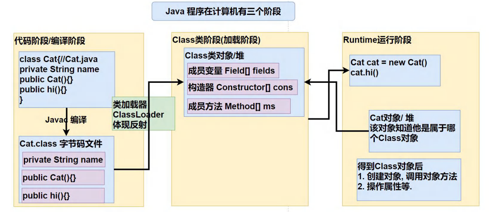

# 反射

JAVA反射机制是在运行状态中，对于任意一个类，都能够知道这个类的所有属性和方法；对于任意一个对象，都能够调用它的任意一个方法和属性；这种动态获取的信息以及动态调用对象的法的功能称为java语言的反射机制。 

## 一、引出反射

**需求**：根据配置文件re.properties 指定信息，创建Cat对象并调用方法hi

这样的需求在框架中特别多，即通过外部文件配置，在不修改源码的情况下，来控制程序，也符合设计模式的ocp原则(开闭原则：不修改源码，扩容功能)，例如下方程序中，如果想将调用的方法从Cat.hi 改为Cat.cry，则不需要修改源码，只需将re.properties中改为method=cry

re.properties:

```
classfullpath=reflection.Cat
method=hi
```

Cat:

```java
package reflection;

/**
 * @program: study
 * @description: 猫猫
 * @author: xiongfeng
 * @create: 2022-06-10 11:55
 **/
public class Cat {
    public void hi () {
        System.out.println("hi 喵喵喵");
    }
    public void cry () {
        System.out.println("cry 喵喵喵");
    }
}

```

**通过放射解决该需求**：

```java
package reflection;

import java.io.FileInputStream;
import java.io.IOException;
import java.lang.reflect.InvocationTargetException;
import java.lang.reflect.Method;
import java.util.Properties;

/**
 * @program: study
 * @description: 反射
 * @author: xiongfeng
 * @create: 2022-06-10 11:58
 **/
public class Reflection {
    public static void main(String[] args) throws IOException, ClassNotFoundException, InstantiationException, IllegalAccessException, NoSuchMethodException, InvocationTargetException {
//        Cat cat = new Cat();
//        cat.hi();
        System.out.println(Cat.class);
        //1. 使用 Properties类,读写配置文
        Properties properties = new Properties();
        properties.load(new FileInputStream("src\\main\\java\\reflection\\re.properties"));
        String classfullpath = properties.getProperty("classfullpath").toString();
        String method = properties.getProperty("method").toString();
        System.out.println(classfullpath + " " + method);

        //2. 创建对象 , 传统的方法，行不通 =》 反射机制
        //new classfullpath()

        //3. 使用反射机制解决
        //(1) 加载类, 返回 Class 类型的对象 cls
        Class cls = Class.forName(classfullpath);
        //(2) 通过 cls 得到你加载的类 reflection.Cat 的对象实例
        Object o = cls.newInstance();
        System.out.println("o 的运行类型=" + o.getClass()); //运行类型
        //(3) 通过 cls 得到你加载的类 com.hspedu.Cat 的 methodName"hi" 的方法对象
        // 即：在反射中，可以把方法视为对象（万物皆对象）
        Method method1 = cls.getMethod(method);
        //(4) 通过 method1 调用方法: 即通过方法对象来实现调用方法
        System.out.println("=============================");
        method1.invoke(o); //传统方法 对象.方法() , 反射机制 方法.invoke(对象)

        //
    }
}
```

## 二、反射机制

1. 反射机制允许程序在执行期间借助于Reflection API取得任何类的内部信息（比如成员变量，构造器，成员方法等），并能操作对象的属性及方法。反射在设计模式和框架底层都会用到
2. 加载完类之后，在堆中就产生了一个Class类型的对象（一个类只有一个Class对象），这个对象包含了类的完整结构信息，通过对这个对象得到类的结构。这个Class对象就像一面镜子，透过这个镜子看到类的结构，所以，形象的称之为：反射
3. Java反射机制可以完成
   - 在运行时判断任意一个对象所属的类
   - 在运行时构造任意一个类的对象
   - 在运行时得到任意一个类所具有的成员变量和方法
   - 在运行时调用任意一个对象的成员变量和方法
   - 生成动态代理




## 三、反射相关类

1. java.lang.Class  代表一个类，Class对象是某个类加载后在堆中的对象
2. java.lang.Method 代表类的方法
3. java.lang.Filed 代表类的成员变量
4. java.lang.Constructor 代表类的构造方法
